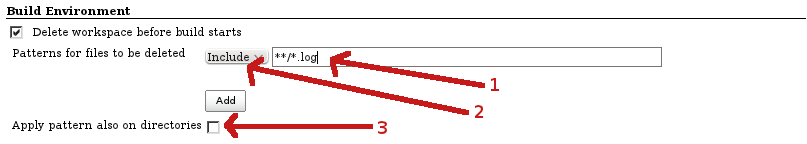

= Workspace Cleanup Plugin
:toc:
:toc-placement!:
:toc-title:
ifdef::env-github[]
:tip-caption: :bulb:
:note-caption: :information_source:
:important-caption: :heavy_exclamation_mark:
:caution-caption: :fire:
:warning-caption: :warning:
endif::[]

link:https://ci.jenkins.io/job/Plugins/job/ws-cleanup-plugin/job/master/[image:https://ci.jenkins.io/job/Plugins/job/ws-cleanup-plugin/job/master/badge/icon[Build Status]]
link:https://github.com/jenkinsci/ws-cleanup-plugin/graphs/contributors[image:https://img.shields.io/github/contributors/jenkinsci/ws-cleanup-plugin.svg[Contributors]]
link:https://plugins.jenkins.io/ws-cleanup[image:https://img.shields.io/jenkins/plugin/v/ws-cleanup.svg[Jenkins Plugin]]
link:https://github.com/jenkinsci/ws-cleanup-plugin/releases/latest[image:https://img.shields.io/github/release/jenkinsci/ws-cleanup-plugin.svg?label=changelog[GitHub release]]
link:https://plugins.jenkins.io/ws-cleanup[image:https://img.shields.io/jenkins/plugin/i/ws-cleanup.svg?color=blue[Jenkins Plugin Installs]]

toc::[]

== Introduction

This plugin deletes the build workspace.

== Getting started

=== https://jenkins.io/doc/book/pipeline/[Pipeline] jobs

There is a single https://www.jenkins.io/doc/pipeline/steps/ws-cleanup/[step] to be used whenever a workspace is allocated.

=== Declarative Pipeline

The `cleanWs` step is available for use with Declarative Pipeline.
When you want to clean the workspace after the build, you can add this step under a suitable condition in the https://www.jenkins.io/doc/book/pipeline/syntax/#post[post] section of your Pipeline job.
If you want to clean the workspace before the build starts, you need to add some extra configuration to be able to clean before the sources are checked out from SCM.
See the examples below for details.

The snippet generator that is built into Jenkins can assist you with what configuration options are available.
Click on the **Pipeline Syntax** button in your Pipeline job and select `cleanWs` from the **Sample Step** drop-down.
For example:

[source,groovy]
----
pipeline {
    agent any
    options {
        // This is required if you want to clean before build
        skipDefaultCheckout(true)
    }
    stages {
        stage('Build') {
            steps {
                // Clean before build
                cleanWs()
                // We need to explicitly checkout from SCM here
                checkout scm
                echo "Building ${env.JOB_NAME}..."
            }
        }
    }
    post {
        // Clean after build
        always {
            cleanWs(cleanWhenNotBuilt: false,
                    deleteDirs: true,
                    disableDeferredWipeout: true,
                    notFailBuild: true,
                    patterns: [[pattern: '.gitignore', type: 'INCLUDE'],
                               [pattern: '.propsfile', type: 'EXCLUDE']])
        }
    }
}
----

=== Freestyle jobs

The plugin provides a build wrapper (**Delete workspace before build starts**) and a post build step (**Delete workspace when build is done**).
These steps allow you to configure which files will be deleted and in what circumstances.
The post build step can also take the build status into account.

This plugin also provides https://plugins.jenkins.io/job-dsl/[Job DSL] support for Freestyle jobs.
For example:

[source,groovy]
----
job("foo") {
    wrappers {
        preBuildCleanup { // Clean before build
            includePattern('**/target/**')
            deleteDirectories()
            cleanupParameter('CLEANUP')
        }
    }
    publishers {
        cleanWs { // Clean after build
            cleanWhenAborted(true)
            cleanWhenFailure(true)
            cleanWhenNotBuilt(false)
            cleanWhenSuccess(true)
            cleanWhenUnstable(true)
            deleteDirs(true)
            notFailBuild(true)
            disableDeferredWipeout(true)
            patterns {
                pattern {
                    type('EXCLUDE')
                    pattern('.propsfile')
                }
                pattern {
                    type('INCLUDE')
                    pattern('.gitignore')
                }
            }
        }
    }
}
----

== Configuration

=== Patterns

Files to be deleted are specified by pattern using https://ant.apache.org/manual/dirtasks.html[Ant pattern syntax].
You can choose if the pattern is an _include_ pattern (if the file matches this pattern, the file will be removed) or _exclude_ pattern (if the file matches this pattern, the file won't be removed).
If there is only an exclude pattern, `\**/*` (i.e., delete everything) will be used as the include pattern, which means that everything will be deleted except the files matching the exclude pattern.
Patterns are applied only on files; if you want to apply them also on directories, check the appropriate box.

WARNING: The directory is deleted with all its contents. If the directory matches the include pattern, everything in the directory will be deleted regardless as to whether some files in the directory match the exclude pattern.

See the documentation for the Ant https://ant.apache.org/manual/api/org/apache/tools/ant/DirectoryScanner.html[`DirectoryScanner`] class for examples of patterns.

=== Deferred wipeout

When the whole workspace is supposed to be deleted (no patterns, external commands, etc.), the Workspace Cleanup plugin delegates to the https://plugins.jenkins.io/resource-disposer/[Resource Disposer] plugin to speed things up.

When deferred wipeout is disabled, the old implementation of filesystem content deletion is used.
If you want the same behavior as with deferred wipeout, you have to set the plugin attribute `deleteDirs` to true as well.
For Pipeline jobs, you can do this as follows:

[source,groovy]
----
cleanWs disableDeferredWipeout: true, deleteDirs: true
----

For e.g. cloud developers it might be useful to be sure deferred wipeout is never selected as a cleanup method.
Therefore there is a new feature introduced to do this, implemented via a regular `NodeProperty` which you can attach to any node via the UI or via a Groovy script as follows:

[source,java]
----
Node.getNodeProperties().add(new DisableDeferredWipeoutNodeProperty());
----

== Issues

Report issues and enhancements in the https://issues.jenkins.io/[Jenkins issue tracker].
Use the `ws-cleanup-plugin` component in the `JENKINS` project.

== Contributing

Refer to our https://github.com/jenkinsci/.github/blob/master/CONTRIBUTING.md[contribution guidelines].

== License

Licensed under link:LICENSE[the MIT License].
